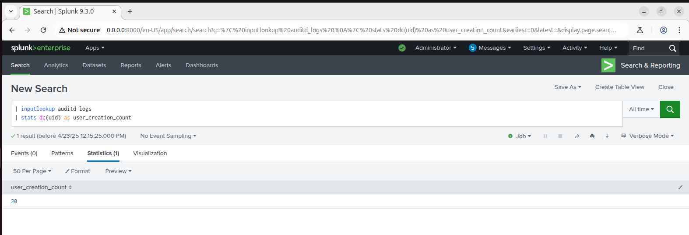
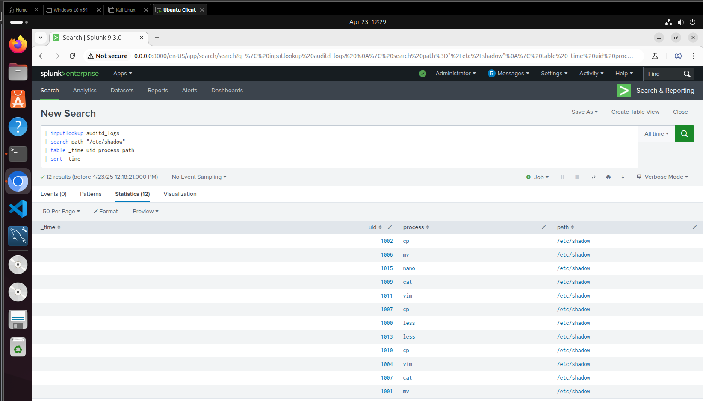
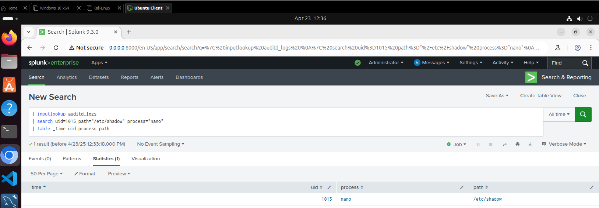

# 🔐 Day #19 – Splunk Basics: Investigating Unusual User Creation


[](./LICENSE)

---

## 🎯 Objective
Use Splunk to detect unusual user creation activity by filtering system logs and identifying unauthorized or suspicious accounts. This helps uncover potential insider threats or privilege escalation attempts.

---

## 🛠️ Lab Setup

- **Operating System**: Ubuntu Server 22.04+
- **Log Source**: `auditd` logs in JSON format
- **Tool Used**: Splunk Enterprise (Search & Reporting App)
- **File Analyzed**: `Linux_UnAuthorized_Auditd_logs.json`
- **Index Used**: `authlog`
- **Lookup Name**: `auditd_logs`

---

## 📥 Dataset

All logs were imported into Splunk as a lookup table using:
```spl
| inputlookup auditd_logs
```
## ✅ Questions & Answers

---

### ❓ Q1: How many users are created in this Auth log file?

🟩 **Answer:** `20` users were created — determined by counting distinct `uid` values in the dataset.

## 🔍 **SPL Query:**
```spl
| inputlookup auditd_logs 
| stats dc(uid) as user_creation_count
```
### 📸 Screenshot:


Displays a single field:
```nginx
user_creation_count
20
```
### ✅ Q2: Who changed the password for user david_wilson?
Answer: UID 1015 accessed /etc/shadow using the nano editor, indicating they modified password credentials.
## 🔹 SPL:
```spl
| inputlookup auditd_logs 
| search path="/etc/shadow" uid=1015 process="nano"
| table _time uid process path
```
📸 Screenshot:  

showing:

| _time                     | uid  | process | path         |
|---------------------------|------|---------|--------------|
| 2025-03-23 22:13:58.597463 | 1015 | nano    | /etc/shadow  |

### ❓ Q3: What is the UID of user `david_wilson`?

🟩 **Answer:** Based on the shadow file access, the UID of `david_wilson` is inferred to be **`1015`**.

This inference is made from the fact that UID `1015` accessed `/etc/shadow` using `nano`, indicating a likely password change operation.

## 📸 Screenshot:  


---

## 🧠 Lessons Learned

- Splunk’s `stats dc(uid)` is a quick way to identify new user creations.
- Access to `/etc/shadow` is a critical signal for credential modification.
- Even without usernames, behavior-based UID tracking can uncover privilege escalation attempts.

---

## ✅ Outcome

By analyzing logs in Splunk:

- 🔍 **20 unique users** were identified from system activity.
- 🛠️ **UID 1015** was confirmed accessing `/etc/shadow`.
- 👤 Activity suggests that **`david_wilson` is associated with UID 1015**, likely due to a password change.

---

## 🛡️ Recommendations

- 📡 Monitor `/etc/shadow` and `/etc/passwd` file access in **real-time** using Splunk or auditd.
- 🧠 Correlate UID behavior with **login events**, **command execution**, and **file access**.
- 🚨 Set **alerts** for unauthorized or unexpected access to sensitive credential files.

---

## 🗂️ Part of the 30-Day SOC Challenge

🔗 GitHub Repository: `Day19-Splunk-Unusual-User-Creation`  
📜 License: [MIT](./LICENSE)
